# Graphs

## 7.1 Graph Terminology
A graph consists of **nodes** (also called **vertices**) that are connected with **edges**.
* `n`: number of nodes (vertices)
* `m`: number of edges

### Weighted and Unweighted Graph
Graphs whose edges or paths have values called weights. Edges value can represent weight/cost/length.

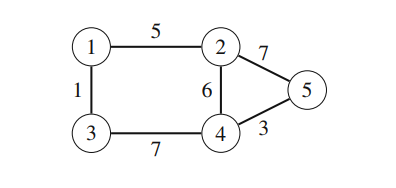

### Directed and Undirected Graph
Edges are directed from one node to another

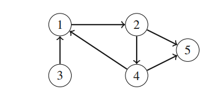

### Path
A path leads from a node to another node through the edges of the graph.

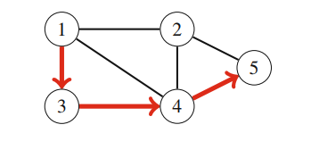

### Cycle
A cycle is a path where the first and last node is the same.

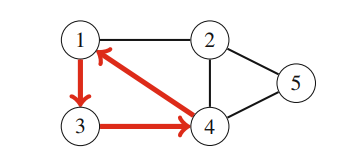

### Connected
A graph is connected if there is a path between any two nodes.

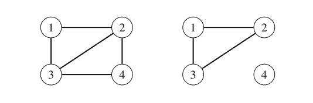

### Tree
A tree is a connected graph that does not contain **cycles**.

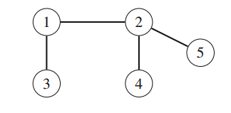

### Neightbors or adjacent
Two nodes are **neighbors or adjacent** if there is an edge between them. 


### Degree
The degree of a node is the number of its neighbors.

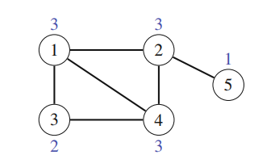

In a directed graph:  
* the **indegree** of a node is the number of edges that end at the node
* the **outdegree** of a node is the number of edges that start at the node.

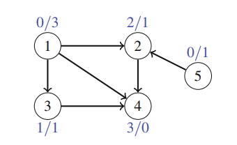

### Bipartite
A graph is **bipartite** if it is possible to color its nodes using two colors in such a way that no adjacent nodes have the same color.

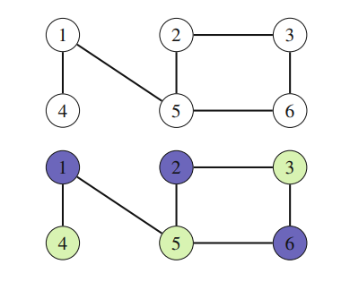


# 7.2 Graph Representation

## Adjacency Lists
**An adjacency list** is an array A of separate lists. Each element of the array `Ai` is a list, which contains all the **vertices** that are adjacent to vertex i.

**Advantages**
* Easy get all the neighbors


* A1 → 2 → 4
* A2 → 1 → 3
* A3 → 2 → 4
* A4 → 1 → 3

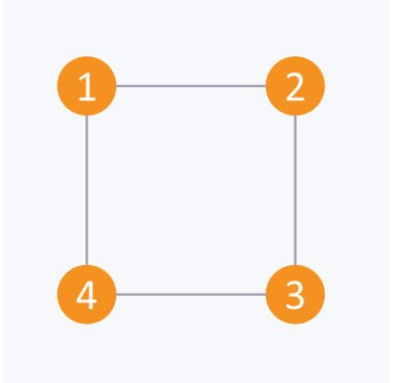

* A1 → 2
* A2 → 4
* A3 → 1 → 4
* A4 → 2

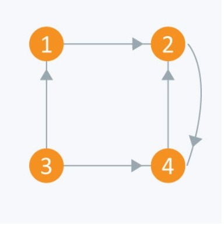

```c++
vector <int> adj[10];

int x, y, nodes, edges;
cin >> nodes;      
cin >> edges;       
for(int i = 0;i < edges;++i)
{
    cin >> x >> y;
    adj[x].push_back(y);        
}

for(int i = 1;i <= nodes;++i)
{        
    for(int j = 0;j < adj[i].size();++j){
        if(j == adj[i].size() - 1)
            cout << adj[i][j] << endl;
        else
            cout << adj[i][j] << " --> ";
    }

```


## Adjacency Matrix
* An adjacency matrix is a `VxV` binary matrix `A`. 

**Advantages**
* Easy to check an edge between 2 vertices O(1).

**Disadvantages**
* Too much memory O(n^2)

* i/j: 1 2 3 4
* 1 : 0 1 0 1
* 2 : 1 0 1 0
* 3 : 0 1 0 1
* 4 : 1 0 1 0

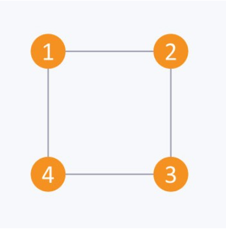

```c++
bool A[10][10];

void initialize()
{
    for(int i = 0;i < 10;++i)
        for(int j = 0;j < 10;++j)
            A[i][j] = false;
}

int x, y, nodes, edges;
initialize();     
cin >> nodes;     
cin >> edges;    
for(int i = 0;i < edges;++i)
{
    cin >> x >> y;
    A[x][y] = true;     
}
```

# Graph Traversal

## Breadth First Search
BFS is a traversing algorithm where you should start traversing from a selected node and traverse the garph layerwise thus exploring the neighbour nodes


**Traverse as follows**:
1. First, move horizontally and visit all the nodes of the current layer.
2. Move to the next layer.

### Traversing child nodes
* Breadth-first search (BFS) visits the nodes in increasing order of their distance from the starting node. Thus, we can calculate the distance from the starting node to all other nodes using breadth-first search. 

**Complexity: O(n+m)** where n is nodes, m is edges

### Implementation
* A typical implementation is based on a queue that contains nodes. At each step, the next node in the queue will be processed.
* New nodes are always added to the end of the queue, and the node at the beginning of the queue is the next node to be processed.'

```c++ 
queue<int> q;
bool visited[N];
int distance[N];
```
* `q`: contains nodes to be processed
* `visited[N]`: indicates which nodes the search has already visited
* `distance[N]`: contains the distances from the starting node to all nodes of the graph
```c++
visited[x] = true;
distances[x] = 0;
q.push(x);

while(!q.empty()){
    int s = q.front(); q.pop();
    // process node s
    for (auto u : adj[s]) {
        if (visited[u]) continue;
        visited[u] = true;
        distance[u] = distance[s]+1;
        q.push(u);
    }
}
```
