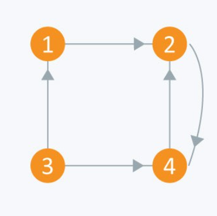

# Graphs

## 7.1 Graph Terminology
A graph consists of **nodes** (also called **vertices**) that are connected with **edges**.
* `n`: number of nodes
* `m`: number of edges

A **path** leads from a node to another node through the edges of the graph.


The **length** of a path is the number of edges in it.

A **cycle** is a path where the first and last node is the same.


A graph is **connected** if there is a path between any two nodes.


A **tree** is a connected graph that does not contain **cycles**.


In a **directed** graph, the edges can be traversed in one direction only.


In a **weighted** graph, each edge is assigned a weight.


Two nodes are **neighbors or adjacent** if there is an edge between them. The **degree** of a node is the number of its neighbors.


In a directed graph:  
* the **indegree** of a node is the number of edges that end at the node
* the **outdegree** of a node is the number of edges that start at the node.


A graph is **bipartite** if it is possible to color its nodes using two colors in such a way that no adjacent nodes have the same color.


## 7.2 Graph Representation

### Adjeacency Lists
 **An adjacency list** is an array A of separate lists. Each element of the array `Ai` is a list, which contains all the **vertices** that are adjacent to vertex i.

 For a **weighted graph**, the weight or cost of the edge is stored along with the vertex in the list using **pairs**. 
 
 In an **undirected graph**, if vertex `j` is in list `Ai` then vertex `i` will be in list `Aj`.
* A1 → 2 → 4
* A2 → 1 → 3
* A3 → 2 → 4
* A4 → 1 → 3


* A1 → 2
* A2 → 4
* A3 → 1 → 4
* A4 → 2


```c++
vector <int> adj[10];

int x, y, nodes, edges;
cin >> nodes;      
cin >> edges;       
for(int i = 0;i < edges;++i)
{
    cin >> x >> y;
    adj[x].push_back(y);        
}

for(int i = 1;i <= nodes;++i)
{        
    for(int j = 0;j < adj[i].size();++j){
        if(j == adj[i].size() - 1)
            cout << adj[i][j] << endl;
        else
            cout << adj[i][j] << " --> ";
    }

```


### Adjacency Matrix

* An adjacency matrix is a `VxV` binary matrix `A`. Element `Aij` is 1 if there is an edge from vertex `i` to vertex `j` else  is `0`
* The adjacency matrix can also be modified for the **weighted graph** in which instead of storing 0 or 1 in , the weight or cost of the edge will be stored.


* i/j: 1 2 3 4
* 1 : 0 1 0 1
* 2 : 1 0 1 0
* 3 : 0 1 0 1
* 4 : 1 0 1 0


* i/j: 1 2 3 4
* 1 : 0 1 0 0
* 2 : 0 0 0 1
* 3 : 1 0 0 1
* 4 : 0 1 0 0



```c++
bool A[10][10];

void initialize()
{
    for(int i = 0;i < 10;++i)
        for(int j = 0;j < 10;++j)
            A[i][j] = false;
}

int x, y, nodes, edges;
initialize();     
cin >> nodes;     
cin >> edges;    
for(int i = 0;i < edges;++i)
{
    cin >> x >> y;
    A[x][y] = true;     
}
```

## Graph Traversal

### Depth-First Search

