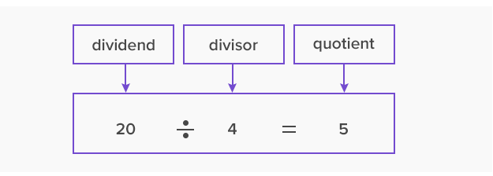
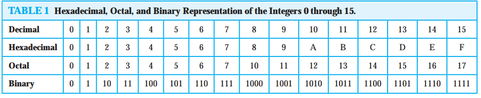

# Number theory

## Divisibility and Modular Arithmetic

Division of an integer by a positive integer produces `a quotient` and `a remainder`. Working with these remainders
leads to modular arithmetic

### Division
When one integer is divided by a second non-zero integer, the quotient may or may not be an integer. 

For example:
> 12/3 = 4 is an integer, whereas 11/4 = 2.75 is not. 

#### Definition 1
> If a and b are integers with a != 0

> we say that `a divides b` if there is an integer `c` such that `b = ac`

> When a divides b we say that a is a `factor` or `divisor` of b. b is a `multiple` of a. The notation `a | b` denotes that a divides b

> We can express `a | b` using quantifiers as `∃c(ac = b)`

Example 1:
> Determine whether `3 | 7` and whether `3 | 12` ?.

> We see that `3 is not | 7`, because `7/3` is not an integer. On the other hand, `3 | 12` because 12/3 = 4.

Example 2:

Let `n` and `d` be positive integers. How many positive integers **not exceeding n** are divisible by d?
> The positive integers divisible by `d` are all the integers of the form `dk`, where `k` is a positive integer.

> Hence, the number of positive integers divisible by `d` that do not exceed `n` equals the number of integers k with `0 < dk ≤ n`, or with `0 < k ≤ n/d`. Therefore, there are `n/d` positive integers not exceeding `n` that are divisible by `d`.

### Theorem 1
Let `a, b and c` be integers and `a != 0` Then: 
1. if a | b and a | c, then a | (b + c);
2. if a | b, then a | bc for all integers c;
3. if a | b and b | c, then a | c.

The divisor is any number that divides another number. A factor, however, is a divisor that divides the number **entirely and leaves no remainder**. 

So, all factors of a number are its divisors. But not all divisors will be factors.

> `q` is called the quotient, and `r` is called the remainder. 

> q = a **div** d, r = a **mod** d

## Representations of integers

